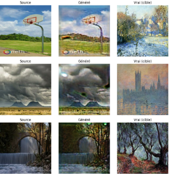

# IA_Application

Durant ce rapport, nous allons passer en revue le travail réalisé durant le projet d'application en IA. Nous avons eu l’opportunité de collaborer avec Air Liquide, une entreprise spécialisée dans le transport de gaz, afin d’apporter notre aide à leur département R&D. Une alternative proposée était de participer à un des challenges Kaggle, offrant une multitude de projets variés. Travailler avec des professionnels nous semblait intéressant, mais un des projets Kaggle a particulièrement retenu notre attention.
Kaggle est une plateforme web qui accueille la plus grande communauté de Data Science au monde. On y retrouve des compétitions proposant de nombreux projets, notamment en deep learning. De notre côté, nous travaillons sur une veille technologique concernant les GAN dans la détection de deepfake pour le module d’IA de la recherche. Il nous semblait donc logique de continuer à explorer les GAN afin de nous spécialiser dans ce type de modèle et de monter en compétences.
Kaggle propose un projet intitulé “I’m Something of a Painter Myself”. Ce projet consiste à utiliser un modèle de type GAN pour créer une peinture reproduisant le style du célèbre peintre Claude Monet à partir d’une photo. Nous avons ainsi décidé d’essayer différents modèles pour évaluer ceux qui fonctionnent le mieux pour ce type de tâche.

# GAN classique

On conclue sur l'étude du GAN classique que selon nos hypothèses de départ, les distributions devraient bouger et même se rapprocher. C’est ce qu’on observe sur les graphiques suivants. Les distributions de nos photos pour la variance et le contraste nous semblaient plus élevées. Maintenant si nous comparons avec nos fausses peintures, on aperçoit des distribution nettement plus proches avec des moyenne presque identique pour le contraste. Nous pouvons donc conclure que notre modèle a réussi à transformer nos photos pour ressembler à des peintures du style de Monet.

# Style GAN 

Pour styleGAN on a conclu que le générateur produit des images qui tentent d'imiter le style de Monet, avec des textures et des palettes de couleurs évoquant le style impressionniste. Cependant, les résultats restent perfectibles, car les motifs générés manquent parfois de finesse et présentent des artefacts. De son côté, le discriminateur parvient à séparer efficacement les vraies images des fausses, les logits montrant qu’il identifie facilement les images générées comme artificielles. Cela suggère que le générateur n’a pas encore atteint un niveau de sophistication suffisant pour tromper le discriminateur, probablement en raison des contraintes d’entraînement.

# Star GAN 

Pour StarGAN on conclue que le générateur démontre sa capacité à traduire des photos en peintures en incorporant des éléments stylistiques caractéristiques du domaine cible, notamment le style de Monet. Cependant, des artefacts visuels tels que des taches ou des zones floues apparaissent sur certaines images traduites, ce qui indique que le modèle n'a pas encore atteint une traduction totalement aboutie. Ces limitations pourraient être dues à un entraînement sur un dataset restreint ou à des ressources limitées. Le discriminateur, quant à lui, réussit à distinguer efficacement les vraies images des images générées, comme en témoignent les logits clairement différenciés. De plus, la prédiction des domaines est généralement précise, bien qu'un léger manque de confiance soit observé dans certains cas, particulièrement pour les images générées. Cela reflète une marge d’amélioration dans la capacité du modèle à généraliser sur des exemples complexes.

# Conclusion de l'étude

À travers ce projet, nous avons pu explorer différentes approches pour transformer des photographies de paysages en peintures dans le style de Monet, en nous appuyant sur des modèles GAN. L’étude préliminaire des données nous a permis de dégager des indicateurs clés (variance, contraste et intensité) afin de qualifier objectivement l’écart entre une photo et une peinture impressionniste. Ces mêmes métriques ont ensuite servi de référence pour évaluer la pertinence des images générées.
Dans un premier temps, le GAN « classique » nous a offert une solide base de compréhension du fonctionnement des réseaux antagonistes : le générateur et le discriminateur s’améliorent mutuellement via un apprentissage dit « en ping-pong ». Malgré quelques difficultés de stabilisation (le discriminateur apprenant parfois plus vite que le générateur), les ajustements d’hyperparamètres, comme la réduction du taux d’apprentissage pour le discriminateur, ont permis d’obtenir des résultats visuellement cohérents. Les mesures de contraste, de variance et d’intensité des images générées se sont rapprochées de celles des véritables peintures, validant le bon fonctionnement du modèle pour ce type de tâche.
Ensuite, l’exploration de modèles plus sophistiqués tels que StyleGAN et StarGAN a mis en avant le potentiel d’une meilleure adaptation du style et d’une traduction multi-domaines (photo ↔ Monet). StyleGAN, avec son approche de contrôle par styles, a offert une granularité plus fine pour générer des détails, tandis que StarGAN a démontré la capacité à gérer simultanément plusieurs domaines de conversion au sein d’un seul réseau. Cependant, la complexité de ces modèles et les contraintes liées à la taille du jeu de données (faible nombre d’images de Monet) ont occasionné des artefacts et des difficultés de convergence plus marquées.
En définitive, nos expériences ont montré que, même avec un ensemble de données limité, il est possible de produire des images convaincantes évoquant le style de Monet. Les indicateurs visuels et statistiques confirment que les GAN, lorsqu’ils sont correctement entraînés et ajustés, parviennent à générer des peintures factices dont les caractéristiques se rapprochent sensiblement de l’œuvre originale. Pour aller plus loin, il serait intéressant d’enrichir le jeu de données, d’approfondir le réglage des hyperparamètres et d’explorer des variantes récentes de GAN qui gèrent mieux la stabilité de l’apprentissage et la diversité des images générées.
